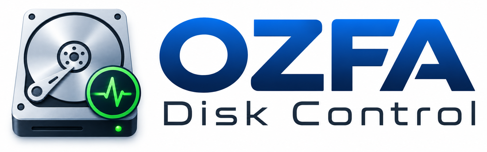
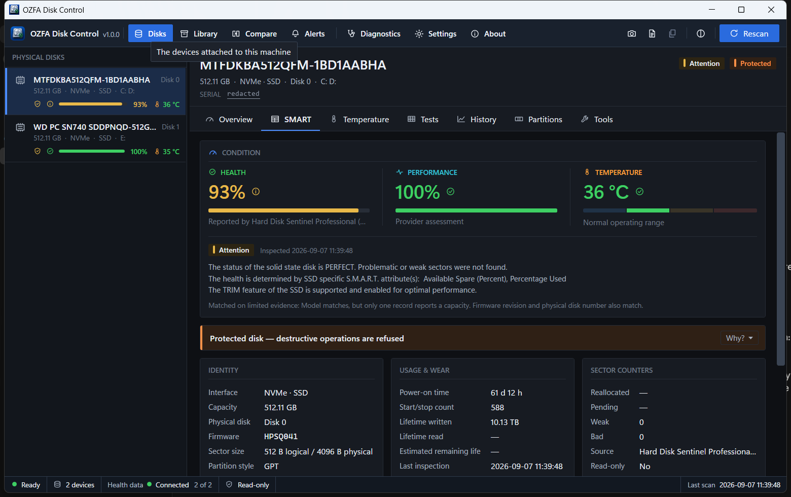
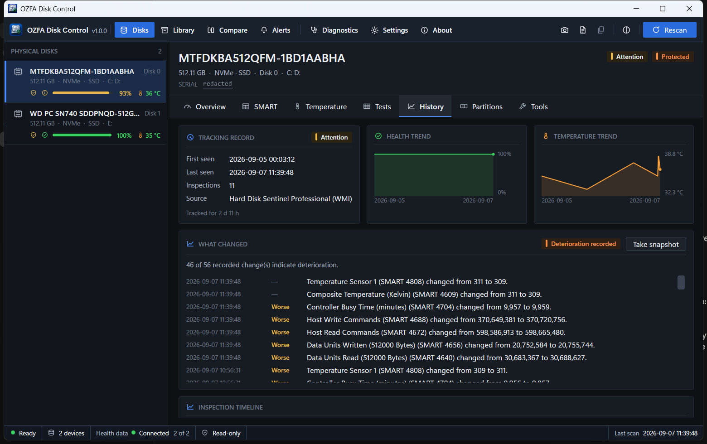
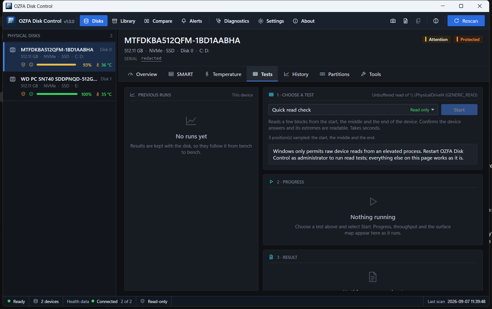
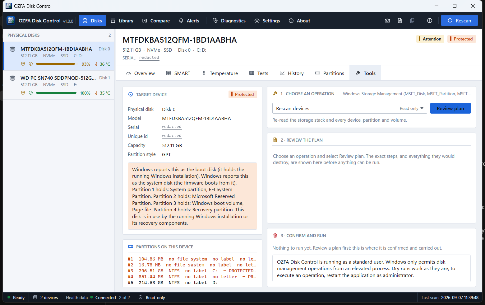

<div align="center">



**Professional disk diagnostics, history and management for Windows technicians.**

Version 1.3.0 · Windows 10 20H1 or later, 64-bit · No .NET installation required

Published installers and checksums are available as GitHub Release assets in this repository.

</div>

---


OZFA Disk Control is a desktop workstation for people who work with disks: HDDs, SSDs, NVMe
drives, USB storage, and disks being prepared for CCTV and NVR duty. It identifies every device
properly rather than by drive letter, reads its condition, remembers what it has seen over time,
tests it without writing to it, prepares it when you ask, and refuses to touch anything it cannot
positively identify.

It is dense on purpose. Health, temperature, protection status and capacity are visible for every
attached device at once, and the pages behind them are one press away.

> **This repository holds releases only.** OZFA Disk Control is proprietary software and its
> source code is not published. Downloads, release notes, checksums and the documentation below
> are what lives here.

| | |
| --- | --- |
|  |  |
| **S.M.A.R.T.** — the full attribute table with raw values, thresholds and what each one means. | **History** — what a disk has done over time, and what changed between two inspections. |
|  |  |
| **Tests** — read-only quick check, surface scan with a live block map, and a sequential benchmark. | **Disk tools** — planned, checked and confirmed before anything is written. |

*Disk serial numbers are redacted in these screenshots. Everything else is a real capture.*

## What it does

- **Finds and identifies** every physical disk — model, serial, firmware, bus, capacity, logical
  and physical sector size — and keeps that identity stable across ports, renumbering and
  reconnection.
- **Reads condition**: health, temperature, performance, power-on time, lifetime writes, sector
  counters and the full SMART attribute table.
- **Remembers**: event-driven history per device, a searchable library of every disk the
  installation has ever seen, and a "what changed" comparison between any two inspections.
- **Warns**: provider-neutral alerting with thresholds you set, duplicate suppression, and
  Windows notifications.
- **Tests, without writing**: quick check, read/verify, a full surface scan with a response-time
  block map, and a sequential read benchmark with temperature measured either side.
- **Prepares disks**: initialize, GPT/MBR, create and delete partitions, drive letters, volume
  labels, online/offline and quick format — each one planned, checked against the safety rules,
  shown in full, and confirmed before it runs.
- **Reports**: a technician report per device as PDF, JSON or CSV.
- **Shares, optionally**: a local-first shared library across your own LAN, off by default.
- **Keeps working when the window is closed**, monitoring from the notification area.

## Download and install

Two editions are published with each release. They are built from one publish of the same code and
behave identically; the only difference is where they keep their data.

| | |
| --- | --- |
| **`OZFA-Disk-Control-v1.3.0-Setup.exe`** | Normal Windows installation: Start Menu entry, uninstall entry, optional desktop shortcut, optional sign-in start. Data lives under `%LOCALAPPDATA%\OZFA\DiskControl`. |
| **`OZFA-Disk-Control-v1.3.0-Portable.zip`** | Unzip and run. Data, settings and logs live in a `Data` folder beside the executable, so the whole installation travels with the folder and leaves nothing behind. |

Both are self-contained — the .NET runtime is inside the download. That is deliberate: this is a
tool you reach for on a machine that is already in trouble, and "install the .NET Desktop Runtime
first" is a poor first instruction.

Full instructions, including how to uninstall and what is left behind, are in
**[docs/INSTALL.md](docs/INSTALL.md)**.

### Verify your download

`SHA256SUMS.txt` is attached to every release. On Windows:

```powershell
Get-FileHash .\OZFA-Disk-Control-v1.3.0-Setup.exe -Algorithm SHA256
```

Compare the result with the line for that file in `SHA256SUMS.txt`.

The release is **not code-signed**, so Windows SmartScreen will warn that the publisher is
unrecognised. Verify the checksum, then choose **More info → Run anyway**.

## Health data requires Hard Disk Sentinel Professional

Version 1 reads advanced health data — the health percentage, the SMART attribute table,
temperature and SSD wear — from **Hard Disk Sentinel Professional** over WMI.

**That is a separate commercial product by a different author. It is not bundled with OZFA Disk
Control, is not installed by it, and is not redistributed by it. You need your own legitimate
licence.** Enable *Report status to WMI* in its configuration, then press **Rescan** in OZFA Disk
Control.

Everything else works without it: discovery, disk identity, partitions and volumes, capacity, read
tests, surface scans, benchmarks, reports, history of what it can see, the shared library and the
disk tools. Health readings are reported as unavailable rather than guessed. The Diagnostics page
shows exactly what the provider returned, field by field, which is the first place to look when a
device is detected but has no health data.

### Plugging in and swapping disks

Hard Disk Sentinel scans on its own schedule, so after a disk is plugged in or swapped it can take
several seconds to describe the new hardware. OZFA Disk Control waits for it rather than guessing:

- **A disk being waited on reads "Detecting health data…"**, not "No health data". The application
  keeps asking for up to about a minute and stops the moment a reading arrives. If none does, the
  disk then reports no health data.
- **A reading from a disk that has been removed is never shown on the disk that replaced it.** When
  drives are swapped in a dock, Windows gives the new drives the disk numbers the old ones had while
  Hard Disk Sentinel is still describing the old ones. Those readings are held back until it has
  rescanned. A drive that reports its own serial number keeps its reading throughout, including when
  it is moved to a different port.
- **Disks in a USB adapter or dock are named after the drive**, as Hard Disk Sentinel reads it, even
  when the adapter reports a plausible-looking name of its own. The adapter is shown alongside. This
  is display only: which disk a destructive operation targets is always decided by the identity
  Windows reports, and the Tools page shows that identity.

These behaviours are covered by automated tests that reproduce the reported scenarios, but they have
**not yet been verified against a real dock or USB adapter**. What a particular dock reports, and how
quickly a particular Hard Disk Sentinel installation rescans, decide what you will actually see.

## Safety

This application can destroy data. Everything below is enforced in code and covered by tests:

- The Windows **system and boot disk is never a destructive target**.
- **Anything the running Windows depends on is protected**, wherever it lives: the volume Windows
  is running from, the system partition the firmware booted, an active page file or hibernation
  file, and the recovery partition Windows itself names. No confirmation unlocks them.
- **A disk is not protected merely for looking like a system disk.** An old Windows installation, a
  Microsoft Reserved Partition, an old EFI or recovery partition from another computer — none of
  those is anything this machine uses, and a secondary disk carrying them can be erased after an
  explicit confirmation. What they earn is a warning naming exactly what is about to be destroyed.
- **A drive letter alone never selects a target.** Identity is resolved to a physical device.
- Every destructive plan is **shown in full** — model, serial, capacity, physical disk number and
  the affected partitions — and **confirmed explicitly** before anything is written.
- The target is **re-checked against the device immediately before execution**, including whether
  the running Windows has come to depend on it since the plan was built.
- **An ambiguous identity fails closed**, never open.
- **Needing administrator rights is never reported as protection.** It is a separate state with its
  own way out — *Continue as administrator* restarts the application elevated and reopens the same
  device, then asks for the plan to be built and confirmed again against a fresh scan.
- The shared library **only ever receives records**. Nothing on a network can start an operation,
  run a test or reach a disk on this machine.

> ### ⚠ Real destructive execution is not yet verified on hardware
>
> The planner, the safety checks, the confirmation flow and the dry run are complete and covered by
> tests. A **real format or repartition has so far only been executed against a test backend**,
> because no disposable disk was available during development. The application says so at the point
> a real run is chosen. Treat a real run as unproven, and use a disk you can afford to lose.
>
> The 1.2 protection rules themselves were checked against real hardware: the system and boot disk
> is refused with its dependencies named, and a secondary disk carrying a leftover Microsoft
> Reserved Partition and a mounted volume is allowed with a warning naming both.

## Privacy

**Nothing about you or your hardware leaves your machine.** There is no telemetry, no analytics
and no crash reporting.

There are exactly two outbound connections the application can ever make:

- **The update check**, to this repository's public releases feed. This one **is on by default** —
  shortly after start-up, and once a day after that. The request carries the running version
  number and nothing else: no machine name, no user name, no identifier of any kind, and nothing
  whatsoever about your disks. It reads a version number and stops there; it **cannot download an
  update, cannot install one, and cannot run anything**. Opening a release happens in your own
  browser. Turn it off entirely in Settings → Updates; everything else works with no network at
  all.
- **The shared library**, to a server address you type in yourself. Off by default.

Everything the application records — disk identities, inspections, SMART snapshots, alerts, test
results and the disk-operation audit trail — is stored locally in a SQLite database, under your
user profile for the installed edition and beside the executable for the portable one.

## Documentation

- [Installing and uninstalling](docs/INSTALL.md) — both editions, and what is left behind.
- [Portable edition read-me](docs/PORTABLE.md).
- [Changelog](CHANGELOG.md).
- [Third-party notices](THIRD-PARTY-NOTICES.md) — every library that ships, and its licence.
- [Licence](LICENSE) — proprietary end user licence agreement.

## Licence

OZFA Disk Control is **proprietary software**. It is not open source and its source code is not
published. The compiled application is licensed for personal use and for the internal business use
of your organisation, including commercial repair work; redistribution and resale are not
permitted. See [LICENSE](LICENSE).

Developed by **KLOWZY**.
